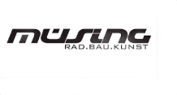
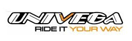

* <a href="https://rainerlueers.github.io/sophies-yard-chronicle/">Startseite</a>
* <a href="https://rainerlueers.github.io/my-tours/">Meine Touren</a>

---
title: Meine Räder
---

## Räder, Touren, Training und viel Schrauben

Auf dieser Seite möchte ich die bis dato von mir gefahrenen Bikes kurz vorstellen.   
Es sind in den vergangenen Jahren einige Räder zusammengekommen   
und mit jedem einzelnen ist eine kleine Geschichte und ein Abschnitt meines Lebens
verbunden.  
Leider habe ich bei einigen Rädern keine oder nur schlechte Fotos gefunden.

### Mein erstes Rennrad - Schauff
#### oder der Beginn einer Leidenschaft

  
Schauff Rennrad

  
Logo 1989

An einem späten Nachmittag, es muß ungefähr 1988 gewesen sein, kam Bernadette von der
Arbeit nach Hause und hatte eine Überraschung für mich dabei. Sie war direkt nach der Arbeit
zum Zweirad- und Nähmaschinenprofi Büld in Lohne gefahren und hatte für uns beide ein 
neues Rennrad gekauft. Büld war damals noch nicht lange im Geschäft und hatte entsprechend
wenig Erfahrung mit der Konfiguration von Rennrädern. 
Zu der Zeit sah man noch recht selten Rennradfahrer auf den Straßen und wenn man einen sah, 
hat man staunend hinterher gesehen.  
Es hat einige Monate gedauert bis ich mich mit der neuen Materie vertraut gemacht hatte, um das
Rad mit entsprechend passenden Komponenten an meinen Bedarf anzupassen. Ursprünglich war
der Rahmen rot. Ich habe mich später für das Umlackieren entschieden und ein peppiges Orange 
gewählt.  
Das Foto wurde von einem professionellen Fotografen am Straßenrand beim Jedermannrennen
Telft-Bastogne-Telft (bekannt als Lüttich-Bastogne-Lüttich) aufgenommen.  
___

### Rickert - Last Edition
#### ein Design-KLassiker

  
Rickert - Campagnolo  

1951 machte sich Rickert mit einer eigenen Werkstatt zur Fertigung von Rahmen für 
Rennräder selbständig. In seiner Werkstatt in Dortmund-Eving wurden in Handarbeit 
Rahmen in den handelsüblichen Rahmengrößen sowie individuell modifizierte 
Sonderanfertigungen gebaut. Es handelte sich bei Rickert-Rahmen ausschließlich 
um Stahlrahmen, die gelötet und gemufft wurden. 
Als Rohrmaterial wurden in der Regel Reynolds-531-Rohre verwendet.  

Auf Rahmen und Fahrrädern der Marke Rickert wurden zahlreiche Titel errungen. 
So wurde Udo Hempel 1970 Weltmeister und 1972 Olympiasieger in der 
Mannschaftsverfolgung auf Rickert-Rahmen. Weitere prominente Kunden 
waren Dieter Gieseler, der 1960 auf einem Rickert-Rad bei den 
Olympischen Spielen in Rom Silber im Zeitfahren errang, sowie Karl-Heinz Marsell, 
der 1961 Steher-Weltmeister wurde. Im Jahre 2002 gab Rickert aus 
gesundheitlichen Gründen sein Handwerk auf und zog in seine 
Heimatstadt Fröndenberg/Ruhr. Von ihm gefertigte Rahmen 
sind begehrte Sammlerstücke.  

<a href="https://web.archive.org/web/20150924160534/http://www.derwesten.de/wp/staedte/froendenberg/radsport-legenden-mit-goldrahmen-id2092985.html" target="_blank" rel="noopener noreferrer" >Radsport-Legenden mit Goldrahmen</a>

  
Meine Maschine (Rickert - Last Edition)  

___  

### Müsing - Millennium
#### Must Have - Aluminium

  
Müsing Millennium (nicht mein bike)

Müsing ist ein deutscher Hersteller von Fahrrädern. 
Sitz der Firma ist in Freirachdorf im Westerwald zwischen Frankfurt und Köln.
Die Anfänge der Produktion von Fahrrädern unter dem Namen Müsing gehen auf die 1980er und 1990er Jahre zurück. 
Seinerzeit produzierte Bernd Müsing, der Student der TU Braunschweig, begeisterter Radsportler und Mitinhaber 
eines Radladens in Braunschweig war, zusammen mit Volker Becker die ersten Fahrräder aus Aluminium unter 
Nutzung der WIG-Schweisstechnik und baute die Rahmenproduktion in Braunschweig auf.  

Mein Müsing Millennium im Einsatz bei einer Gruppenfahrt in Ketschendorf, Franken.

  
Mein Müsing Millennium  

___

### Univega - Via
#### Solides Arbeitsgerät - (Aluminiumrahmen - Carbongabel)

Dieses ausserordentlich zuverlässige Rennrad ist aktuell im Einsatz.
Ich habe es im Jahr 2024 bei 2 Etappenfahrten über je 450 km als Bike Packing Maschine verwendet. Heute ist es 
auf dem Smart-Trainer als Indoor-Trainingsrad montiert und verrichtet zuverlässig seine Dienste.  

